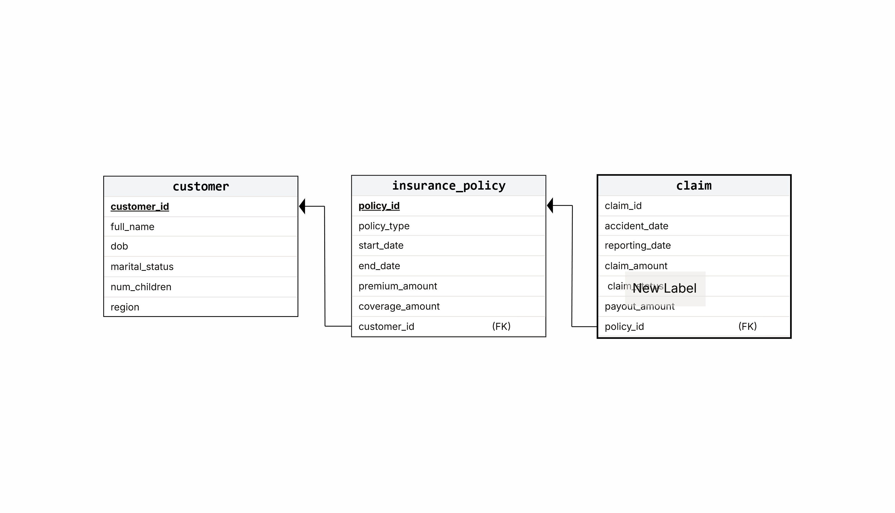

# Insurance Data Mart — SQL & Data Engineering Portfolio Project

This repository simulates the core analytical processes of an insurance company, including policies, customers, claims, insurance metrics and KPIs.
The project demonstrates the end-to-end design of a small **Insurance Data Mart**, including:
- Generation of realistic **synthetic data** using Python + Faker;
- Creation of **dimensional data mart structures**;  
- Analytical SQL queries for insurance metrics and KPIs: **GPE**, **exposure**, **frequency**, and **claims analysis**;
- Production-ready SQL scripts.

---

## 🏗️ Project Overview

### 🎯 Goal  
Build a realistic insurance analytics environment using SQL and Python to demonstrate data generation, data modelling, and data analysis using SQL. 

## 🧬 Synthetic Data Generation
Data is generated using Python and the `Faker` library with realistic business logic:

### ✔️ `generate_customers.py`
- Creates customers with:
  - Name
  - DOB
  - Marital status
  - Number of children (realistic distribution)
  - Region (NZ regions)

### ✔️ `generate_policies.py`
- Assigns insurance policies to customers:
  - Policy type (Auto, House, Contents, Life…)
  - Start / end dates (exactly 1-year policies)
  - Premium amount (GPW)
  - Coverage amount

### ✔️ `generate_claims.py`
- Creates claims with:
  - Accident date (must fall within policy period)
  - Reporting date  
  - Claim status  
  - Claim amount  
  - Payout logic  
    - 0 for Rejected/Pending  
    - 80% Approved = full payout  
    - 20% Approved = partial payout  
---

## 🗄️ Data Mart Schema

`create_insurance_data_mart.sql` builds the full relational schema:

#### ER Diagram

#### Relational Schema

---

## 📊 Analytical SQL (analysis_queries.sql)

Includes insurance metrics and KPIs:
### **📌 Annual Gross Premium Written (GPW) by Line of Business (LOB)**
- Typical insurance KPI that used to estimate sales by LOB;
- Other intervals (month, quarter) cam be applied as well.

### **📌 Running Total of Monthly GPW by Year (Common Table Expression (CTE) + Window Function)**
- Common insurance KPI to estimated YTD (Year-to-Date) sales  
- SQL query includes CTE to aggregate sales by month and year and a window function to calculate running total

### **📌 Gross Premium Earned (GPE)**
- Accurate day-level overlap calculation  
- Handles partial policy periods  
- Supports custom intervals (e.g., Q1 2025)

### **📌 Exposure Calculation**
- Overlapping policy days / full policy duration  
- Used for frequency

### **📌 Frequency**

## 🧩 SQL Queries
Full scripts are available in:
- [`create_insurance_data_mart.sql`](create_insurance_data_mart.sql)  
- [`analysis_queries.sql`](analysis_queries.sql)

---
