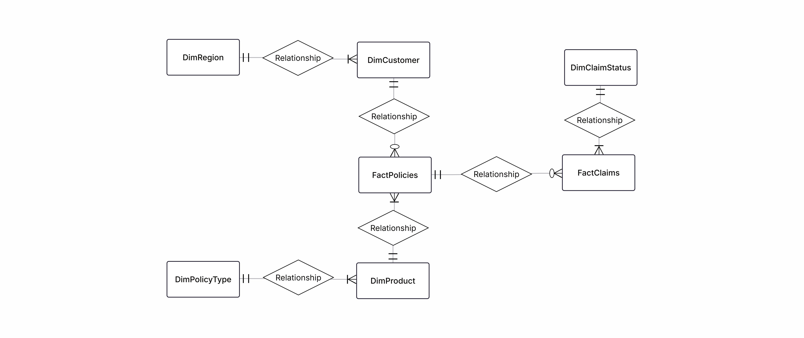
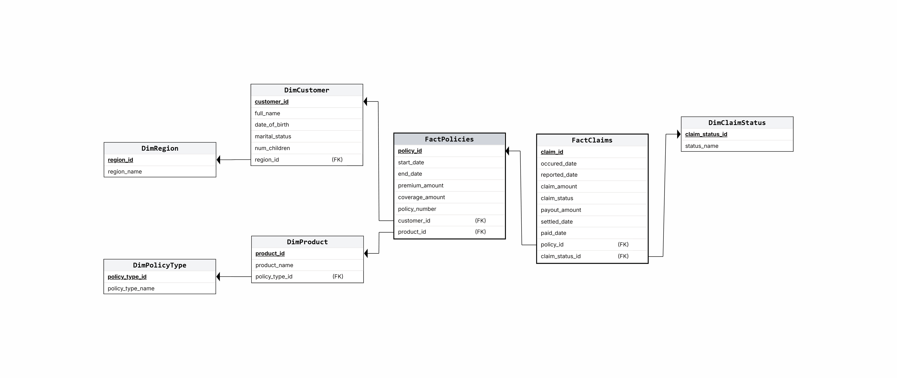

# Insurance Data Mart — SQL & Data Engineering Portfolio Project

This repository simulates the core analytical processes of an insurance company, including policies, customers, claims, insurance metrics, and KPIs.
The project demonstrates the end-to-end design of a small **Insurance Data Mart**, including:
- Generation of realistic **synthetic data** using Python + Faker;
- Creation of **dimensional data mart structures**;  
- Analytical SQL queries for insurance metrics and KPIs: **GPE**, **exposure**, **frequency**, and **claims analysis**;
- Production-ready SQL scripts.

---

## 🏗️ Project Overview

### 🎯 Goal  
Build a realistic insurance analytics environment to demonstrate data generation, data modelling, and data analysis using SQL. 

## 🧬 Synthetic Data Generation
Data is generated using Python and the `Faker` library with realistic business logic:

### ✔️ `generate_customers.py`
- Creates customers with:
  - Name;
  - Date of birth;
  - Marital status;
  - Region (NZ regions).

### ✔️ `generate_policies.py`
- Assigns insurance policies to customers:
  - Policy number
  - Product (Basic Health Cover, Premium Health Cover, etc.) and Line of Business (Health, Travel, etc.);
  - Start and end dates;
  - Premium amount (GPW);
  - Coverage amount.

### ✔️ `generate_claims.py`
- Creates claims with:
  - Occurred date (must fall within policy period);
  - Reporting date;
  - Settled date for approved and rejected claims
  - Claim status (Approved, Pending, Rejected); 
  - Claim amount (lognormal distribution); 
  - Payout logic:
    - 0 for Rejected/Pending;  
    - 80% Approved = full payout within coverage amount; 
    - 20% Approved = partial payout.
      
---

## 🗄️ Data Mart Schema

`create_insurance_data_mart_2.sql` builds the full relational schema:

#### ER Diagram

#### Relational Schema

---

## 📊 Analytical SQL (analysis_queries.sql)

Includes insurance metrics and KPIs:
### **📌 Annual Gross Premium Written (GPW) by Line of Business (LOB)**
- A typical insurance KPI for estimating sales by LOB;
- Other intervals (monthly, quarterly) can be applied as well.

### **📌 Running Total of Monthly GPW by Year (Common Table Expression (CTE) + Window Function)**
- Common insurance KPI for estimating YTD (Year-to-Date) sales;
- SQL query includes a CTE to aggregate sales by month and year, and a window function to calculate running total.

### **📌 Customer Analytics (Nested Queries, Window Function)**
Includes various typical analytical tasks:
- Ranking Customers by Lifetime Net Value (LTV);
- Customers with More Than 2 Claims per Policy (Nested Query);
- Customers with More Than 2 Claims in the Past Year;
- Top 3 Customers by Payout Amount.

### **📌 Frequency Calculation (Common Table Expression (CTE))**
Claim frequency calculation is one of the main tasks in insurance analytics, used for premium pricing.
- Claim Frequency for Expired Policies by LOB and Year;  
- Exposure-Based Frequency for a specific reporting period.

### **📌 Claim Severity by LOB and Year**
Severity is average cost per claim, also used for premium pricing.

### **📌 Gross Premium Earned (GPE) per LOB (Common Table Expressions (CTE))**
- Accurate day-level overlap calculation; 
- Handles partial policy periods; 
- Supports custom intervals (e.g., Q1 2025).

## 🧩 SQL Queries
Full scripts are available in:
- [`create_insurance_data_mart.sql`](create_insurance_data_mart.sql)  
- [`analysis_queries.sql`](analysis_queries.sql)

---
